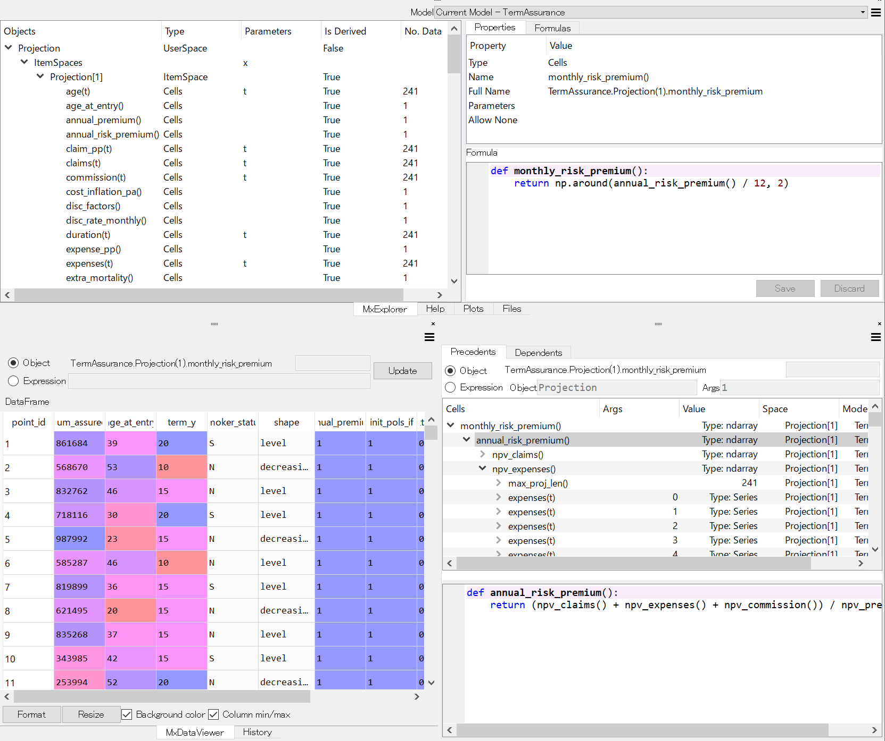

.. modelx documentation master file, created by
   sphinx-quickstart on Fri Mar  3 23:28:52 2017.
   You can adapt this file completely to your liking, but it should at least
   contain the root `toctree` directive.

modelx
======
*Use Python like a spreadsheet!*

   Spyder plugin for modelx

Latest Updates
--------------

.. include:: updates.rst
   :start-after: Latest Updates Begin
   :end-before: Latest Updates End

:doc:`... See more updates<updates>`

.. include:: ../../README.rst
   :start-after: Overview Begin
   :end-before: Overview End

What Next
---------

- :doc:`Installation </installation>`
- :doc:`Tutorial <tutorial/index>`
- :doc:`Reference </reference/index>`

.. toctree::
   :maxdepth: 2
   :caption: Contents

   whatsnew
   installation
   spyder
   tutorial/index
   userguide/index
   reference/index

* :ref:`genindex`
* :ref:`search`
