Spyder plugin
=============

`Spyder`_ is a popular open-source Python IDE,
and it's bundled in with major Python distributions such as
`Anaconda <https://www.anaconda.com/>`_
and `WinPython <https://winpython.github.io/>`_ by default.
`Spyder`_ allows plugins to be installed to add extra features to itself.

**Spyder plugin for modelx** enriches user interface to modelx in Spyder.
The plugin adds custom IPython consoles
and GUI widgets for using modelx in Spyder.

Th plugin consists of 4 components, **MxConsole**,
**MxExplorer**, **MxDataViewer** and **MxAnalyzer**.

**MxConsoles** appear as tabs in Spyder's default IPython console widget,
and host custom IPython shells.
The custom shells function exactly as the default IPython shells,
except that the custom shells are connected to the plugin widgets.
You should use the custom shells instead of
Spyder's default shells in order for the other plugin widgets
to interface with the user's Python sessions.
The plugin widgets do not interface with Python running in default IPython
consoles.

**MxExplorer** is the main plugin widgets, and
it contains an object tree pane showing the object tree of
a selected Model. From the context menu on the object tree,
you can perform various operations, such as creating
and deleting modelx objects, defining names bound to objects in the selected
Model, etc. On the right-hand side of MxExplorer, there are
a property pane and formula pane for showing detail information.

**MxDataView** lets you see values of
vector and tabular data in modelx objects,
such as :obj:`list`, :obj:`set`, :obj:`tuple`,
:obj:`dict`, `numpy`_ `array`_, in addition to
`pandas`_ `DataFrame`_, `Series`_, and `Index`_ in a tabular format.
It also shows the values and types of scalar objects,
such as :obj:`int` and :obj:`str`.

.. _numpy: https://numpy.org/
.. _array: https://numpy.org/doc/stable/reference/generated/numpy.array.html
.. _pandas: https://pandas.pydata.org/
.. _DataFrame: https://pandas.pydata.org/docs/reference/api/pandas.DataFrame.html
.. _Series: https://pandas.pydata.org/docs/reference/api/pandas.Series.html
.. _Index: https://pandas.pydata.org/docs/reference/api/pandas.Index.html

**MxAnalyzer** enables you to visually trace calculation dependency.
For a specified combination of a Cell and arguments called *node*,
MxAnalyzer shows a tree of preceding nodes or descending nodes.

The plugin widgets are "dockable" as Spyder's default widgets, meaning
you can detach those widgets from the Spyder's main window to have their
own separate windows, and "dock" them back in the main window at
different positions
to rearrange the widgets positions in the main window as you like.

.. contents:: Plugin components
   :depth: 1
   :local:

.. _Spyder: https://www.spyder-ide.org/

.. _MxExplorerAndMxConsole:

MxExplorer and MxConsole
------------------------

If the plugin is installed successfully, then you should
see the plugin components showing or hiding in the Spyder window,
except for *MxConsole*.

If you don't find any plugin widgets, go to *View->Panes* menu, and
check *MxExplorer*, *MxDataViewer* and *MxAnalyzer*.
If you don't find such menu items then check the plugin
supports your Spyder version and update your Spyder if it's not supported.
If you still can't find plugin widgets,
post an issue on
`modelx github site <https://github.com/fumitoh/modelx/issues>`_.

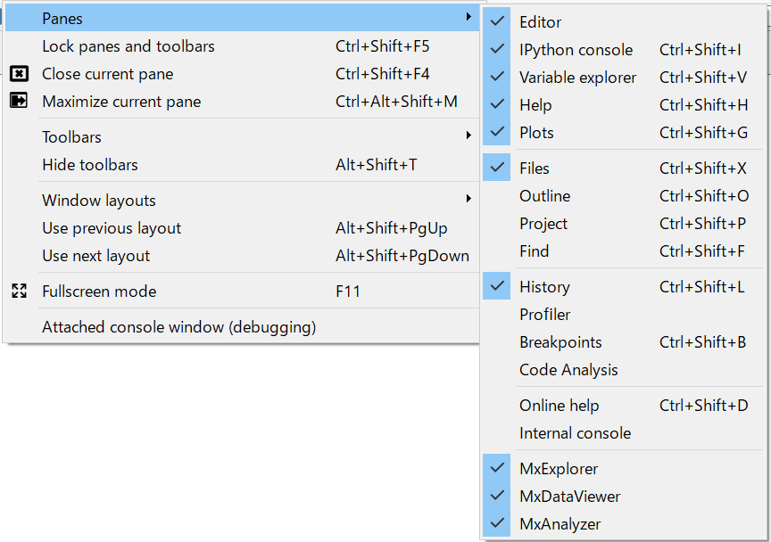

MxExplorer looks like below just after startup.

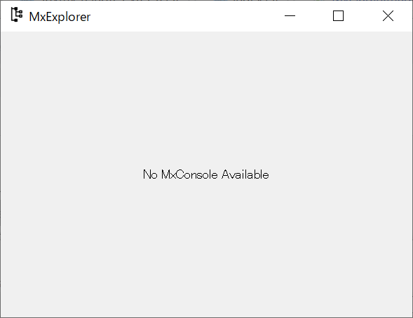

Right-click ont the IPython console tab in the lower right pane, then click
*Open a MxConsole* menu.

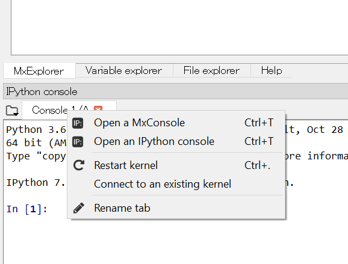

Once the MxConsole is ready, then the plugin widgets get populated with
clean panes.

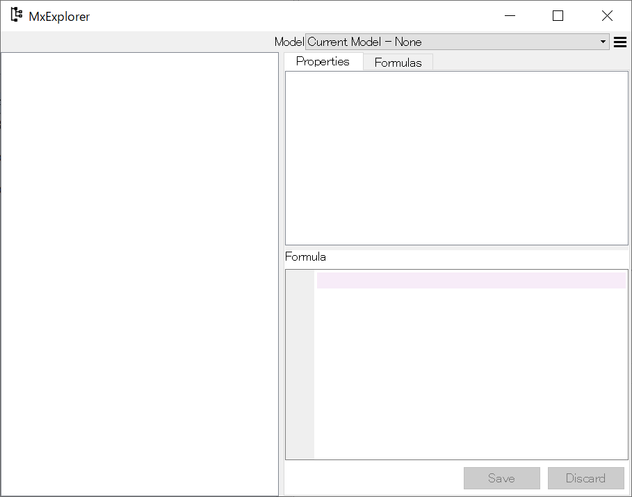

The *MxConsole* works exactly the same as a regular IPython console,
except that the console is connected to
the plugin widgets and they can be used to interact with modelx components
in the Python session in the console.
To test the behaviour,
create a new model and space in the MxConsole like this::

    >>> import modelx as mx

    >>> model, space = mx.new_model(), mx.new_space()

    >>> cells = space.new_cells()

The modelx explorer shows the component tree of the created space.

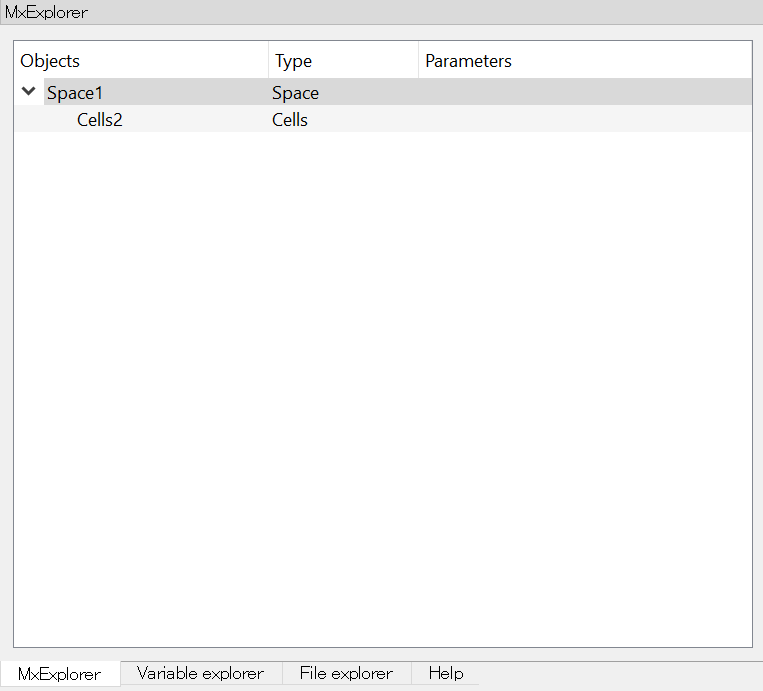

Select *Cells2* in the tree by double-clicking on it.
You will see the pane on the
right-hand side of MxExplorer gets populated with properties of *Cells2*
and its Formula appears in the lower half of the pane.

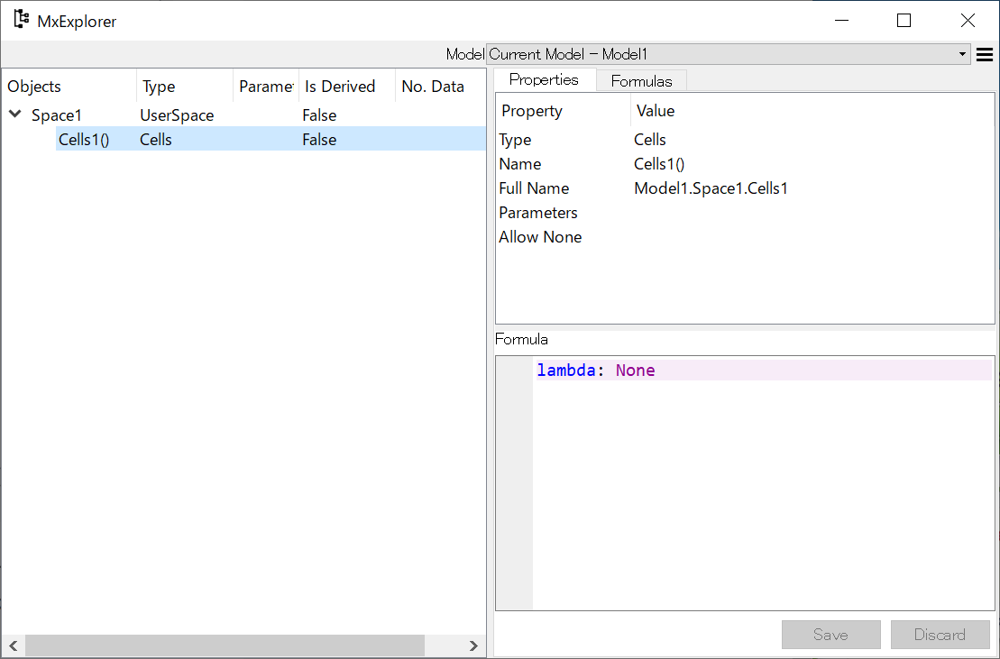

MxExplorer can also list the formulas of all Cells in a selected Space.
Select a Space in the tree, right-click to
bring up the context menu, and the click *Show Formulas*.
The list of the formulas appears to the right of the model tree in MxExplorer.

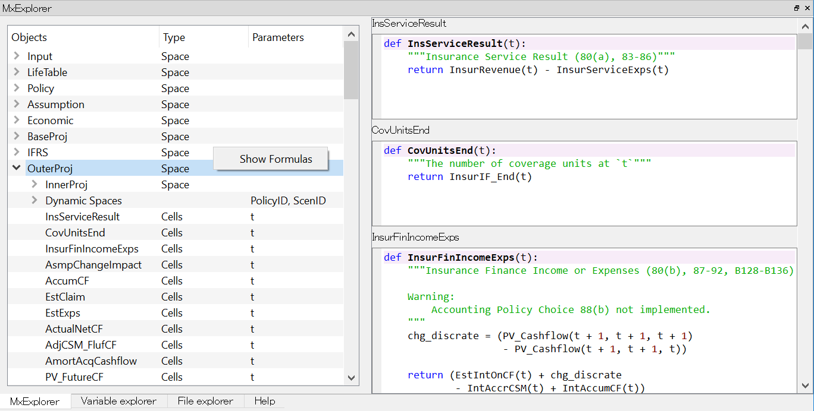

.. _MxDataViewer:

MxDataViewer
------------

*MxDataViewer* lets you see values of
vector and tabular data in modelx objects,
such as :obj:`list`, :obj:`set`, :obj:`tuple`,
:obj:`dict`, `numpy`_ `array`_, in addition to
`pandas`_ `DataFrame`_, `Series`_, and `Index`_ in a tabular format.
It also shows the values and types of scalar objects,
such as :obj:`int` and :obj:`str`.

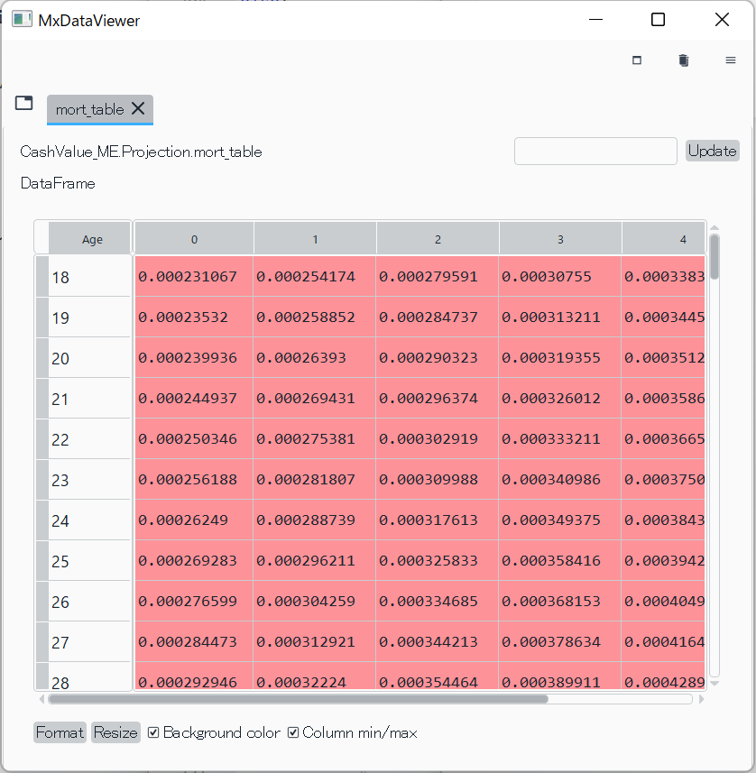

   MxDataViewer showing a pandas DataFrame

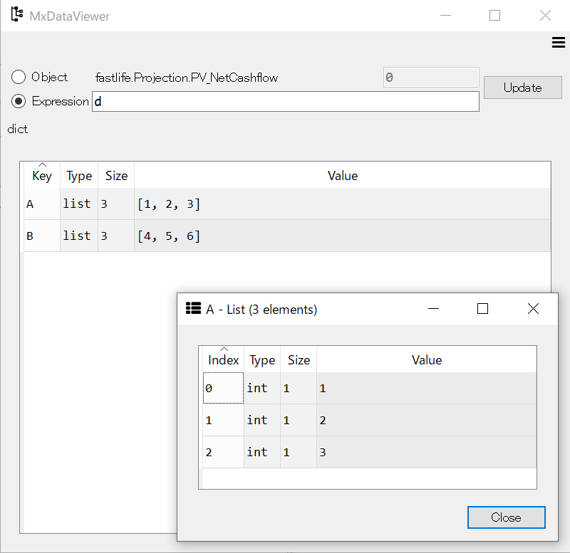

   MxDataViewer showing a dict and its nested lists

If MxDataViewer widget is not shown, Go to *View->Panes* menu as you did with
MxExploer, and check *MxDataViewer*.

To specify the object to examine,
enter a Python expression that returns
the object in the text box labeled *Expression* and
click the *Update* button.
The Python expression is evaluated in the global namespace of the
Python session in the active MxConsole.

Alternatively, you can examine the value of the object
selected in *MxExplorer*.

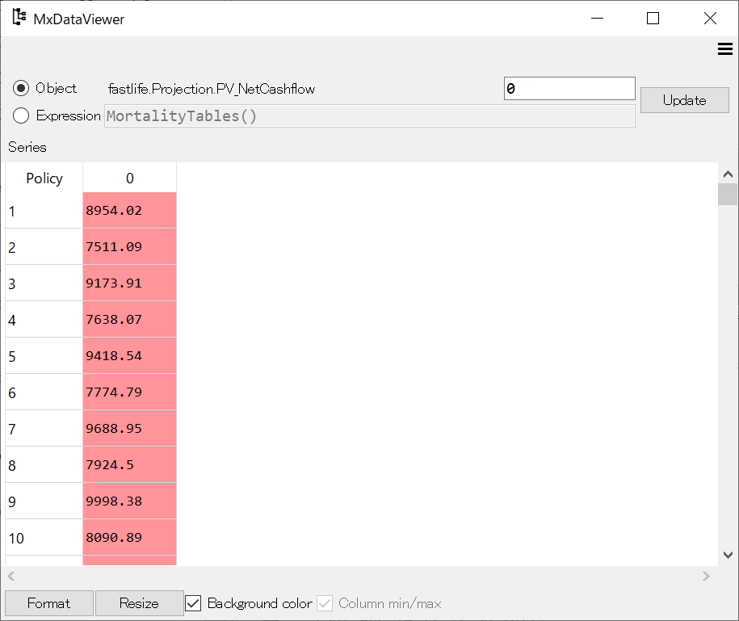

   MxDataViewer showing the value selected in MxExplorer

.. _MxAnalyzer:

MxAnalyzer
----------

MxAnalyzer enables you to visually trace calculation dependency.

If MxDataView widget is not shown, Go to *View->Panes* menu as you did with
MxExploer, and check *MxAnalyzer*.

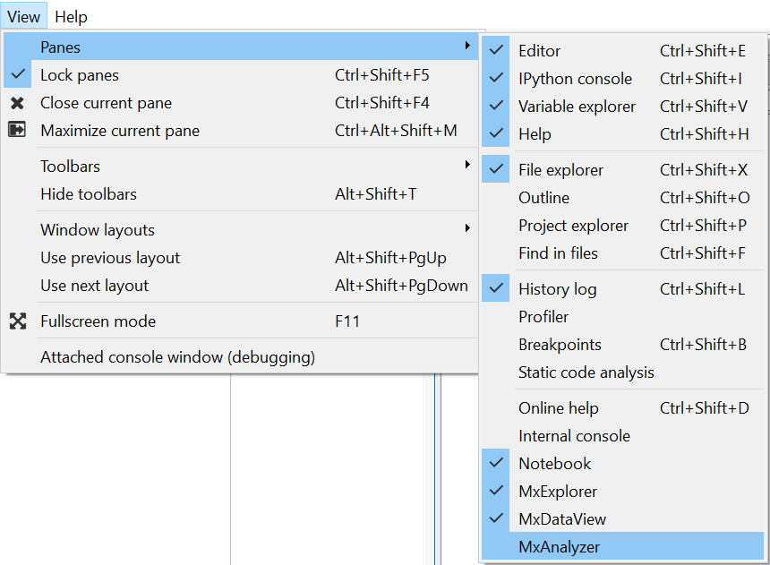

MxAnalyzer has two tabs, one for tracing the precedents,
nodes that the selected node depends on,
and the other for tracing the dependents, nodes that depends on
the selected nodes.

Select *Precedents* tab and
enter an expression that returns a Cells object in the text box titled
*Expression*, and arguments to the Cell in the *Args* box next to it.
The Python expression is evaluated in the global namespace of the
Python session in the active MxConsole.
Then MxAnalyzer shows a tree of Cell nodes directly or indirectly used in
calculating the value of the specified node.

Alternatively, you can set the object to analyze from MxExplorer.
By clicking the *Analyze Selected* item in the MxExplorer context
menu, the selected object is set in MxAnalyzer (currently,
only Cells can be selected).

.. figure:: /images/relnotes/spymx_v0_7_0/MxExplorerAnalyzeMenu.png
   :align: center

   *Analyze Selected* context menu item on MxExplorer

Each tab in MxAnalyzer has two split panes in it.
The upper pane is for the dependency tree,
and the lower pane shows the formula of the selected object in the tree.

.. figure:: /images/relnotes/spymx_v0_7_0/EnhancedMxAnalyzer.png
   :align: center

   Dependency tree and Formula pane in MxAnalyzer

The *Value* column in the dependency tree shows
the type of each object if it's not a scalar value.
By double-clicking on the *Value* column or right-clicking and selecting
*Show Value* from the context menu, the value of the selected
element is shown in a pop-up window.
The pop-up window shows values of :obj:`list`, :obj:`set`, :obj:`tuple`,
:obj:`dict`, `numpy`_ `array`_, in addition to
`pandas`_ `DataFrame`_, `Series`_, and `Index`_ in a tabular format.

.. figure:: /images/relnotes/spymx_v0_7_0/MxAnalyzerShowValueMenu.png
   :align: center

   *Show Value* context menu item on MxAnalyzer

.. figure:: /images/relnotes/spymx_v0_7_0/MxAnalyzerPopUpSeries.png
   :align: center

   Pop-up window showing the values of a Series

