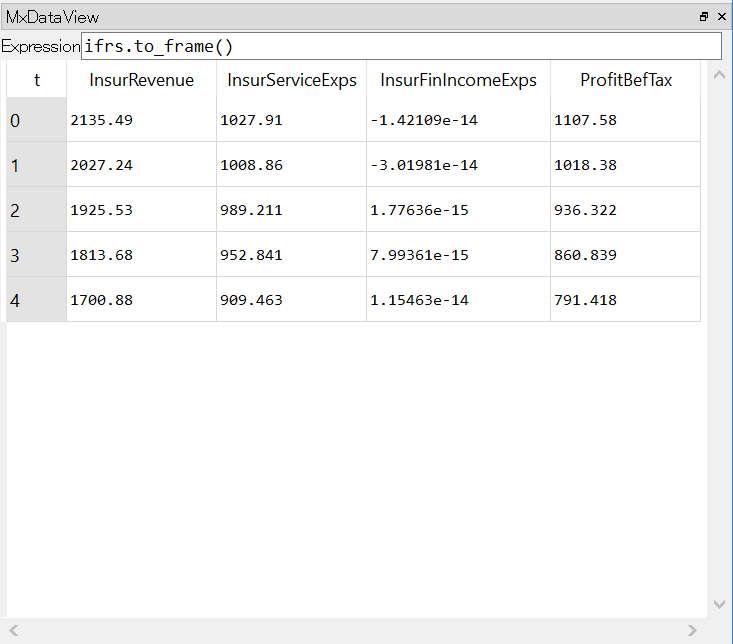

Spyder plugin
=============

`Spyder`_ is a popular open-source Python IDE,
and it's bundled in with `Anaconda <https://www.anaconda.com/>`_ by default.
`Spyder`_ allows plugins to be installed to add extra features to itself.

**Spyder plugin for modelx** enriches user interface to modelx in Spyder.
The plugin adds custom IPython consoles
and GUI widgets for using modelx in Spyder.

The plugin is under active development, and currently comes with
a primary version of components, including:

* MxConsole
* MxExplorer
* MxDataView

**MxConsole**  appears as tabs in Spyder's default IPython console,
and runs custom IPython shells. Users should use these shells instead of
Spyder's default shells in order for the other plugin widgets
to interface with the user's Python sessions.
The plugin widgets do not interface with Python running in default IPython
consoles.

**MxExplorer** is the main plugin widgets, and it shows the object tree of
the current modelx model in the active MxConsole. It can also lists formulas
of cells in a selected space next to the tree.

**MxDataView** shows data in modelx objects in a
spreadsheet-like tabular format.

The plugin widgets are "dockable" as Spyder's default widgets, meaning
you can detach those widgets from the Spyder's main window to have their
own separate windows, and "dock" them back in the main window at
different positions
to rearrange the widgets positions in the main window as you like.

.. _Spyder: https://www.spyder-ide.org/
.. _install-spyder-plugin:

Configure Spyder
----------------

**Disable User Module Reloader**

When you use modelx with Spyder, sometimes you may want to re-run the
same file in the editor window multiple times in the same IPython session.
You don't want to reload modelx because reloading modelx module creates
multiple instances of modelx systems within the same Python process,
causing models created before and after a reload to reside in different
modelx systems. To avoid that, you need to change *User Module Rloader (UMR)*
setting.

From the Spyder menu, select *Tools->Preferences* to bring up Preferences window.
Choose *Python interpreter* in the left pane, and you'll find an area titled
*User Module Rloader (UMR)* on the bottom right side of the Preferences window.
Uncheck *Enable UMR* option to disable User Module Reloader. This prevents
Spyder from reloading modelx module every time you re-run the same script
from *Run* menu.

Note that you need to restart Spyder to bring the change into effect.

.. figure:: /images/spyder/PreferencesUMR.png

   User Module Reloader setting

Installing Spyder plugin for modelx
-----------------------------------

The plugin is available as a separate Python package named ``spyder-modelx``.

The supported version of Spyder is 3.2.5 or newer. The plugin does not
work with Spyder versions older than 3.2.5.

To install the plugin, run the following command in the command prompt::

    $ pip install spyder-modelx

If Spyder is running while the plugin gets installed, close Spyder once
and restart it to bring the plugin into effect.

MxExplorer and MxConsole
------------------------
To enable the modelx plugin, start Spyder, and go to *View->Panes* menu, and
check *MxExplorer*.

.. figure:: images/spyder/SpyderMainMenuForModelx.png

Then the Modelx explorer tab appears in the upper right pane.

.. figure:: images/spyder/BlankMxExplorer.png

Right-click ont the IPython console tab in the lower right pane, then click
*Open a MxConsole* menu.

.. figure:: images/spyder/IPythonConsoleMenu.png

A modelx console named *MxConsole* starts. The modelx console works
exactly the same as a regular IPython console,
except that the modelx explorer shows the components of the current model
in the IPython session of this console. To test the behaviour,
create a new model and space in the modelx console like this::

    >>> import modelx as mx

    >>> model, space = mx.new_model(), mx.new_space()

    >>> cells = space.new_cells()

The modelx explorer shows the component tree of the created space.

.. figure:: images/spyder/MxExplorerTreeSample.png

MxExplorer can also list the formulas of all cells in a selected space.
To see the formulas in a space,
select the space in the tree, right-click to
bring up the context menu, and the click *Show Formulas*.
The list of the formulas appears to the right of the model tree in MxExplorer.

.. figure:: images/spyder/CodeListExample.png

MxDataView
----------

MxDataView widget lets you see a DataFrame object in a spreadsheet-like
tabular format.

If MxDataView widget is not shown, Go to *View->Panes* menu as you did with
MxExploer, and check *MxDataView*.

.. figure:: images/spyder/SpyderMainMenuForModelx.png

To specify the DataFrame object to display,
enter a Python expression that returns
the DataFrame object, in the text box labeled *Expression*.
The Python expression is evaluated in the global namespace of the
Python session in the active MxConsole. The expression is
re-evaluated every time MxConsole execute a Python command.

