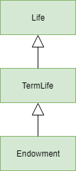

Tutorial
========
This tutorial aims to introduce core concepts and features of modelx, and
demonstrate how to use modelx by going through some examples.

This tutorial supplements the modelx reference,
which is build from docstrings of the API functions and classes,
and the reference should cover the detailed description of each API element,
which may not be fully explained in this tutorial.

Typical workflow
----------------
modelx is a Python package, and you use it by writing a Python script
importing it, as you would normally do with any other Python package.

modelx is best suited for building a complex numerical models composed of
many formulas referencing each other, so when you start from scratch,
the typical workflow would be to first write code for building a model,
and then evaluate the model.

As we are going to see, it takes more than one line of code to build a model,
so it's convenient to use a Python shell that allows you edit and execute
a chunk of code at once for building a model, then get into an interative mode
for letting you examine the model one expression or statement at a time.

IDLE, the Tk/Tcl based simple Python GUI shell that comes with CPython
lets you do that. You can open an editor window, and when the part of
building a model is done, you can press F5 to save and run the script
in a Python shell window where you are prompted to enter Python code to
evaluate the model. Jupyter notebook and many other popular Python shell
environments have similar capability.

Model, Space and Cells
----------------------
Before taking a look at the very first example, you might want to
have an idea on what Model, Space and Cells are, as those three types
of objects are central to modelx.

Model, Space and Cells are to modelx
what workbook, worksheet and cells are to a spreadsheet program respectively,
although there are differences.
The diagram below illustrates containment
relationship between those objects.

.. figure:: images/ObjectContainment.png

   Model, Space and Cells

A model is a unit of work. It can be saved to a file and loaded again.
A model contains spaces. In turn, spaces can contain cells and also other
spaces (subspaces). Spaces also serves as the namespace for contained
cells but we'll get to this later.

A Cells can have a formula that calculates the cells' values, just like
spreadsheet cells can have formulas. Cells values are either calculated
by the formula or assigned as an input. We will learn how to define
cells formulas through the examples soon.

First example
-------------
We'll start by talking a closer look at the simple example we saw
in the overview section.

.. literalinclude:: samples/example_overview.py
   :lines: 1-13

To start using modelx, import the package by the import statement, as is the
case with any other package.

.. literalinclude:: samples/example_overview.py
   :lines: 1

By doing so, you get to use modelx API functions in ``__main__`` module.
If you're not comfortable with importing modelx API functions directly into
the global namespace of ``__main__`` module, you can alternatively import
``modelx`` as an abbreviated name, such as ``mx``, for example::

    import modelx as mx

in which case you can use modelx API functions prepended with ``mx.``.
We'll assume importing ``*`` in this tutorial, but be reminded that this
is not a good practice when you write Python modules.

Creating Models
---------------

Then on the next line, we are creating a new Model object:

.. literalinclude:: samples/example_overview.py
   :lines: 3

``new_model()`` is a modelx API function which returns a newly created
model. You can specify the name of the model by passing it as ``name`` argumet
to the function, like ``new_model(name='MyModel')``.
If no name is given as the argument,
the returned model is named automatically by modelx.
Confirm the model is created by ``get_models()`` function, which returns
a mapping of the names of all existing models to the model objects::

   >>> get_models()
   {'Model1': <modelx.core.model.Model at 0x447f1b0>}

Creating Spaces
---------------

Now that you have created a brand new model, you can create a space in
the model by calling its ``new_space()`` method.

.. literalinclude:: samples/example_overview.py
   :lines: 3

Just as with the models, the name of the space can be specified by
passing it to the method ``name`` argument, otherwise the space gets its
name by modelx.

Getting Spaces
--------------

To get all spaces in a model mapped to their names,
you can check ``spaces`` property of the model::

   >>> model.spaces
   mappingproxy({'Space1': <modelx.core.space.Space at 0x4452790>})

The return MappingProxy objects acts like an immutable dictionary, so you can
get Space1 by ``model.spaces['Space1']``. You can see the returned space is
the same object as what is referred as ``space``::

   >>> space is model.spaces['Space1']
   True

Creating Cells
--------------
There are a few ways to create a cells object and defiene the formula
associated with the cells. As seen in the example above,
one way is to define a python function with ``defcells`` decorator.

.. literalinclude:: samples/example_overview.py
   :lines: 3-

By this definition, the cells is created in the current space in the current
model. modelx keeps the last operated model as the current model, and
the last operated space for each model as the current space.
``get_model()`` API function returns
the current model, and ``currentspace`` property of a model holds
its current space.

To specify the space to create a cells in, you can pass the space object as
an argument to the ``defcells`` decorator. Below is the same as
the definition above, but explicitly specifies in what space to define
the cell::

   @defcells(space)
   def fibo(n):
       if n == 0 or n == 1:
           return n
       else:
           return fibo(n - 1) + fibo(n - 2)

Getting Cells
-------------
Similar to spaces in a model contained in the ``spaces`` property of the model,
cells in a space are associated with their names and
contained in the ``cells`` property of the model::

   >>> fibo is space.cells['fibo']
   True

There is another way of accessing cells. You can just use `.` with cells names,
just like accessing the spaces's attribute::

   >>> space.fibo
   <modelx.core.cells.Cells at 0x51ed090>
   >>> fibo is space.fibo
   True

Getting Cells Values
--------------------
The cells ``fibo`` does not have values yet right after it is created.
To get cells' value for a
certain parameter, simply call ``fibo`` with the paratmer in parenthesis or
in squre brackets::

   >>> fibo[10]
   55
   >>> fibo(10)
   55

Its values are calculated automatically by the associated formula,
when the cells values are referenced.
Note that values are calculated not only for the specified parameter,
but also for the parameters that recursively referenced by the formula
in order to get the value for the specified parameter.
To see for what parameters values are calculated, export fibo to a Pandas
Series object. (You need to have Pandas installed, ofcourse.)::

   >>> fibo[10]
   55
   >>> fibo.series
   n
   0      0
   1      1
   2      1
   3      2
   4      3
   5      5
   6      8
   7     13
   8     21
   9     34
   10    55
   Name: fibo, dtype: int64

Since ``fibo[10]`` refers to ``fibo[9]`` and ``fibo[8]``,
``fibo[9]`` refers to ``fibo[8]`` and ``fibo[7]``, and
the recursive reference goes on until it stops and ``fibo[1]`` and ``fibo[0]``.
by just calling ``fibo[10]``, values for the parameters from 0 to 10 are
calculated.

Model
-----
Models are to modelx what workbooks are to a spreadsheet program.
Among Model, Space and Cells, Model is the largest concept.
Models contain spaces.
Spaces can be directly contained in a model, but cells cannot.
Cells must be contained in a space.
You can save models to files, and later load them back into memory.

**Getting spaces**

**Global namespace**

Space
-----
Spaces are containers of cells and other spaces.
If a space contain other spaces, the contained spaces are called subspaces
of the containing space.

Spaces can be created in a model by calling the model's ``new_space``
method::

   model, space = new_model(), new_space('TheSpace')

Spaces reside directly in models, but they can also reside in other spaces.
Subspaces can be created in a space in the same way as spaces are created
in a model, by calling the spaces's ``new_space`` method::

   subspace = space.new_space('TheSubspace')

**Getting spaces**

To get all the spaces that are directly contained in a parent, whether it's
a model or a space, ``spaces`` property

To obtain a space object from a Python script,

Namespace
---------
In addition to serving as containers, spaces have a very important
role of being the namespaces for the formulas of their contained cells.
Spaces have ``namespace`` attribute, which is a mapping of names to objects.

<Insert sample code here>

Formulas are created from Python's function definitions.
Python statements and expressions in functions
are evaluated in the lexical context,
so it matters to Python functions where in the source code they are defined.

However, when modelx create formula objects from Python function definitions,
modelx alters this lexical scoping with dynamic scoping.

When a formula is executed in modelx,
global names that appear in the formula code are resolved based on the
parent's namespace mapping object.

The namespace is composed of other mappings. cells, spaces and refs

Cells
-----
A Cells cannot reside in multiple Spaces at the same time.
A Cells can be moved from one Space to another.

References
----------
Often times you want access from cells formulas in a space to other objects
than cells in the same space.
References are names bound to arbitrary objects that are accessible from
within the same space.

As a cell container
-------------------

Static subspaces
----------------
As previously mentioned, spaces can be created in another space.
Spaces in another space are called subspaces of the containing space.

You can obtain a subspace as an attribute of the parent space,
or by accessing the parent space's ``spaces``
attribute::

  >>> parent.a_subspace

  >>> parent['a_subspace']

Space inheritance
-----------------
Space inheritance is a concept analogous to class inheritance
in object-oriented programming languages.
By making full use of space inheritance, you can minimize duplicated
formula definitions, keeping your model organized and transparent
and maintain model integrity.

Inheritance lets one space use(inherit) other spaces, as base spaces.
The inheriting space is called a derived space of the base spaces.
The cells in the base spaces are copied automatically in the derived space.
In the derived space, formulas of cells from base spaces can be overridden.
You can also add cells to the derived space, that do not exist in any
of the base spaces.

A space can have multiple base spaces. This is called multiple inheritance.
The base spaces can have their base spaces, and derived-base relationships
between spaces make up a directional graph of dependency.
In case of multiple inheritance, we need a way to order base spaces to
determine the priority of base spaces.modelx uses
C3 superclass linearization algorithm (a.k.a C3 Method Resolution Order or MRO)
for ordering the base spaces. Python uses the C3 MRO for obtaining the oder
of which method should be inherited.
https://www.python.org/download/releases/2.3/mro/

https://en.wikipedia.org/wiki/C3_linearization

**Inheritance Example**

Let's see how inheritance works by a simple code of
pricing life insurance policies.
First, you create a very simple life model as a space and name it ``Life``.
You populate the space with cells that calculate the number of death
and remaining lives by age.

Then to price a term life policy, you derive a ``TermLife`` space from
the ``Life`` space, and add some cells to calculate death benefits
paid to the insured, and their present value.

Next, you want to model an endowment policy. Since the endowment policy
pays out a maturity benefit in addition to the death benefits covered by the
term life policy, you derive a ``Endowment`` space from ``TermLife``,
and make a residual change to the ``benefits`` formula.

**Creating the Life space**

Below is a mathematical representation of the life model we'll
build as a ``Life`` space.

.. math::
   &l(x) = l(x - 1) - d(x - 1)\\
   &d(x) = l(x) * q

where, :math:`l(x)` denotes the number of lives at age x,
:math:`d(x)` denotes the number of death occurring between the age x
and age x + 1, :math:`q` denotes the annual mortality rate
(for simplicity, we'll assume a constant mortality rate of 0.003 for all ages
for the moment.)
One letter names like l, d, q would be too short for real world practices,
but we use them here just for simplicity,
as they often appear in classic actuarial textbooks.
Yet another simplification is, we set the starting age of x at 50, just
to get output shorter. As long as we use a constant mortality age,
it shouldn't affect the results whether the starting age is 0 or 50.
Below the modelx code for this life model:

.. literalinclude:: samples/sample_inheritance.py
   :lines: 6-20

The last line of the code above has the same effect as putting ``@defcells``
decorator on top of each of the 3 function definitions.
This line creates 3 new cells
from the 3 functions in the ``Life`` space, and rebind names ``l``, ``d``,
``q`` to the 3 cells in the current scope.

To examine the space, you can check values of the cells in ``Life`` as below::

   >>> l(60)
   97040.17769489168

   >>> life.frame
                      l           d      q
   x
    50.0  100000.000000  300.000000    NaN
    51.0   99700.000000  299.100000    NaN
    52.0   99400.900000  298.202700    NaN
    53.0   99102.697300  297.308092    NaN
    54.0   98805.389208  296.416168    NaN
    55.0   98508.973040  295.526919    NaN
    56.0   98213.446121  294.640338    NaN
    57.0   97918.805783  293.756417    NaN
    58.0   97625.049366  292.875148    NaN
    59.0   97332.174218  291.996523    NaN
    60.0   97040.177695         NaN    NaN
   NaN              NaN         NaN  0.003

**Deriving the Term Life space**

Next, we'll see how we can extend this space to represent a term life policy.
To simplify things, here we focus on one policy with the sum
assured of 1 (in whatever unit of currency).
With this assumption, if we define ``benefits(x)`` as the expected value at
issue of benefits paid between the age x and x + 1, then it should
equate to the probability of death between age x and x + 1, of the
insured at the point of issue. In a math expression, this should be written:

.. math::
   benefits(x) = d(x) / l(x0)

where :math:`l(x)` and :math:`d(x)` are the same definition from the
preceding example, and :math:`x0` denotes the issue age of the policy.
And further we define the present value of benefits at age x as:

.. math::
   pv\_benefits(x) = \sum_{x'=x}^{x0+n}benefits(x')/(1+disc\_rate)^{x'-x}

``n`` denotes the policy term in years, and ``disc_rate`` denotes the
discounting rate for the present value calculation.

Continued from the previous code, we are going to derive the ``TermLife`` space
from the ``Life`` space, to add the benefits and present value calculations.

.. literalinclude:: samples/sample_inheritance.py
   :lines: 25-41

The first line in the sample above creates ``TermLife`` space derived
from the ``Life`` space, by passing the ``Life`` space as ``bases`` parameter
to the ``new_space`` method of the model. The ``TermLife`` space at this point
has the same cells as its sole base space ``Life`` space.

The following 2 cells definitions (2 function definitions with ``defcells``
decorators), are for adding the cells that did not exist in ``Life``
space. You must have noticed that the formulas are referring to the names
that are not defined yet. Those are ``x0``, ``n``, ``disc_rate``.
We need to define those in the ``Life`` space.

.. literalinclude:: samples/sample_inheritance.py
   :lines: 46-48

You get the following results by examining the ``TermLife`` space (The
order of the columns in the DataFrame may be different on your screen).::

   >>> term_life.pv_benefits(50)
   0.02959822305108317

   >>> term_life.frame

                   d      q              l  pv_benefits  benefits
   x
    50.0  300.000000    NaN  100000.000000     0.029598  0.003000
    51.0  299.100000    NaN   99700.000000     0.026598  0.002991
    52.0  298.202700    NaN   99400.900000     0.023607  0.002982
    53.0  297.308092    NaN   99102.697300     0.020625  0.002973
    54.0  296.416168    NaN   98805.389208     0.017652  0.002964
    55.0  295.526919    NaN   98508.973040     0.014688  0.002955
    56.0  294.640338    NaN   98213.446121     0.011733  0.002946
    57.0  293.756417    NaN   97918.805783     0.008786  0.002938
    58.0  292.875148    NaN   97625.049366     0.005849  0.002929
    59.0  291.996523    NaN   97332.174218     0.002920  0.002920
    60.0         NaN    NaN            NaN     0.000000  0.000000
    61.0         NaN    NaN            NaN     0.000000       NaN
   NaN           NaN  0.003            NaN          NaN       NaN

You can see that the values of ``l``, ``d``, ``q`` cells are the same
as those in ``Life`` space, as ``Life`` and ``LifeTerm`` have exactly
the same formulas for those cells, but be aware that
those cells are not shared between the base and derived spaces.
Unlike class inheritance in OOP languages, space inheritance is in terms of
space instances(or objects), not classes,
so cells are copied from the base spaces to derived space
upon creating the derived space.

**Deriving the Endowment space**

We're going to create another space to test overriding inherited cells.
We will derive ``Endowment`` space from ``LifeTerm`` space. The diagram
below shows the relationships of the 3 spaces considered here.
A space from which an arrow originates is derived from the space the
arrow points to.

   Life, TermLife and Endowment

The endowment policy pays out the maturity benefit of 1
at the end of its policy term.
We have defined ``benefits`` cells as the expected value of benefits,
so in addition to the death benefits considered in ``LifeTerm`` space,
we'll add the maturity benefit by overriding the ``benefits`` definition
in ``Endowment`` space. In reality, the insured will not get both death
and maturity benefits, but here we are considering an probabilistic model,
so the benefits would be the sum of expected value of death and maturity
benefits:

.. literalinclude:: samples/sample_inheritance.py
   :lines: 53-62

And the same operations on the ``Endowment`` space produces the following
results::

   >>> endowment.pv_benefits(50)
   1.0
   >>> endowment.frame
          pv_benefits  benefits              l      q           d
   x
    50.0     1.000000  0.003000  100000.000000    NaN  300.000000
    51.0     0.997000  0.002991   99700.000000    NaN  299.100000
    52.0     0.994009  0.002982   99400.900000    NaN  298.202700
    53.0     0.991027  0.002973   99102.697300    NaN  297.308092
    54.0     0.988054  0.002964   98805.389208    NaN  296.416168
    55.0     0.985090  0.002955   98508.973040    NaN  295.526919
    56.0     0.982134  0.002946   98213.446121    NaN  294.640338
    57.0     0.979188  0.002938   97918.805783    NaN  293.756417
    58.0     0.976250  0.002929   97625.049366    NaN  292.875148
    59.0     0.973322  0.002920   97332.174218    NaN  291.996523
    60.0     0.970402  0.970402   97040.177695    NaN         NaN
    61.0     0.000000       NaN            NaN    NaN         NaN
   NaN            NaN       NaN            NaN  0.003         NaN

You can see ``pv_benefits`` for all ages and ``benefits`` for age 60
show values different from ``TermLife`` as we overrode ``benefits``.

``pv_benefits(50)`` being 1 is not surprising. The ``disc_rate``
set to 1 in ``TermLife`` space is also inherited to the ``Endowment`` space.
The discounting rate of benefits being 1 means by taking the
present value of the benefits, we are simply taking the sum of
all expected values of future benefits, which must equates to 1,
because the insured gets 1 by 100% chance.

Dynamic spaces
--------------
In many situations, you want to apply a set of calculations in a space,
or a tree of spaces, to different data sets.
You can achieve that by applying the space inheritance on dynamic spaces.

Dynamic spaces are parametrized spaces that are created on-the-fly when
requested through call(``()``) or subscript(``[]``) operation on their parents.

To define dynamic spaces in a parent, whether it's a model or a space,
You create the parent with a parameter function whose signature is
used to define space parameters. The paremter function should return,
if any, a mapping of parameter names to their arguments,
to be pass on to the ``new_space`` method, when the dynamic spaces
are created.

To see how this works, let's continue with the previous example.

Dynamic spaces of a base space are not passed on to the derived spaces.
When a space is derived from a base space that has dynamically created
subspaces, those dynamically created subspaces themselves are not passed
on to the derived spaces. Instead, the parameter function of the base
space is inherited, so subspaces of the derived space are created upon
call(using ``()``) or subscript (using ``[]``) operators
the derived space with arguments.

Reading Excel files
-------------------

Exporting to Pandas objects
---------------------------
